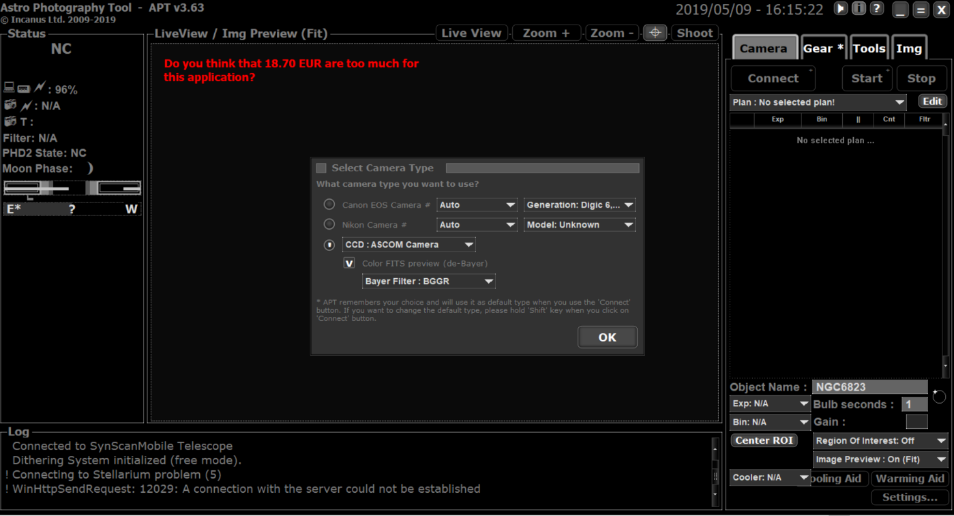
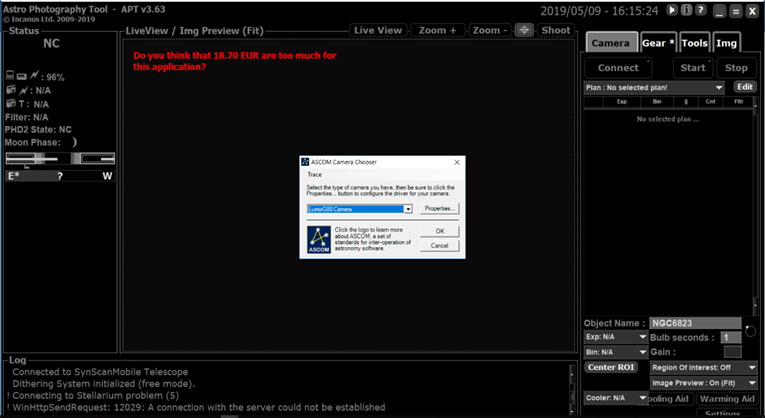
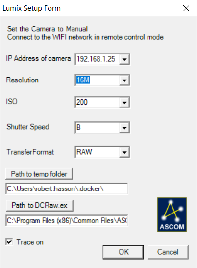
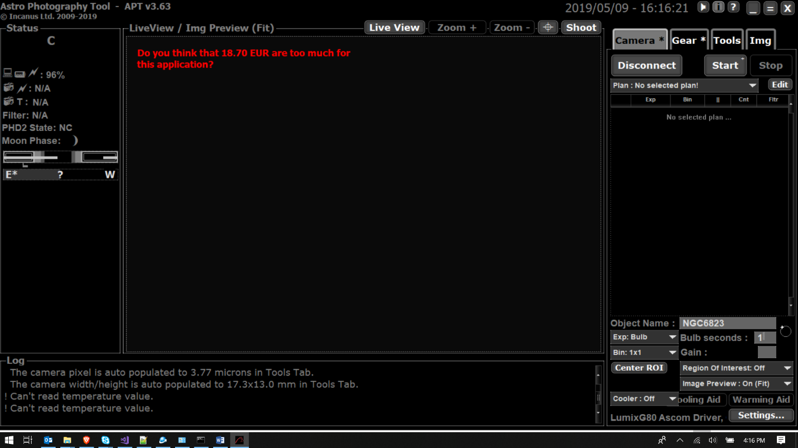
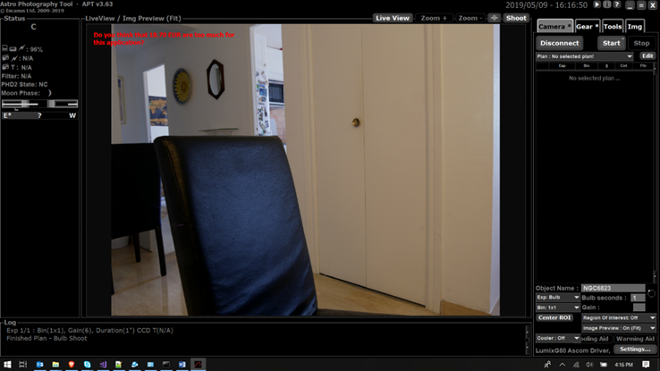

# ASCOM Camera driver for Panasonic Lumix Cameras

## Purpose

This driver presents Lumix cameras as ASCOM cameras so they can be used by astro photo software like APT, NINA or SharpCap. It can talk to the camera two ways:

* **Wi-Fi** - the Lumix http remote control protocol. The camera believes that it is connected to the Panasonic ImageApp.
* **USB** - the Panasonic Lumix USB (PTP) SDK, over the cable. Much faster than Wi-Fi and there is no wireless session to drop.

See [Connection modes](#connection-modes) for what each one supports.

The driver was tested with the G80, GH4 and GH5s but should work with all Wifi Lumix.

**Your camera needs one of the two transports.** Either built-in Wi-Fi with "Remote Shooting"
(the ImageApp protocol), or USB tethering the Panasonic SDK recognises. Bodies that predate
both - the 2009 **GH1** is the usual example - cannot be driven at all: no Wi-Fi to connect to,
and LUMIX Tether does not support them either. A sensor size appearing in the table below only
means the driver knows that body's geometry; it does not imply the body can be reached.

16MP sensor was the prototype. Now it is possible to work with a range of sensor sizes such as:  
 * 10M (GH5s)
 * 12MP (GH1 - geometry only, see the note above)
 * 16MP (GH4, G80, etc.)
 * 20MP (GH5, G9, etc.)
 * Full Frame also like S1 and S1-R (but this hase not been tested)


Notes: 
1. ASCOM still exposes no "liveView" or video mode, so it cannot be handed to your imaging software. The driver now provides its own **Live View window**, opened from the setup dialog, on both Wi-Fi and USB - useful for framing and focusing. See [Live view](#live-view).
Mostly this driver sets the ISO (i.e. Gain), ShutterSpeed, Capture (Start and Abort) and GetImageArray methods along with other needed methods for ASCOM.
3. All settings are stored in the ASCOM Proflie Explorer
4. Trace log is stored in default ASCOM location 
2. Presumably could also work with the full frame S series from Panasonic since it shares the same http protocol. The different format of the sensor should be handled but i have no way of testing it. (this is a call to get loaned an S1 to test!)


 
## Connection modes

Pick the transport at the top of the setup dialog. The driver detects a cabled camera
and preselects USB when it finds one, because the body cannot be on Wi-Fi and USB at
the same time.

| | Wi-Fi | USB (Standard) | USB Extended (Tether) |
|---|---|---|---|
| needs | camera on the same network, in "Remote Shooting" | USB cable, camera in PC mode | as USB, plus Panasonic **LUMIX Tether** installed |
| transfer formats | JPG, RAW, Thumb | RAW | RAW, JPG |
| exposures | discrete speeds + bulb | discrete speeds | discrete speeds **and bulb of any length, including over 60 s** |
| live view | yes (MJPEG over UDP, VGA or QVGA) | yes | yes |
| speed | ~8-15 s per RAW frame (direct link) | ~3-6 s per frame | ~3-6 s per frame |
| 32-bit build | yes | no | no |

**USB Extended** is the interesting one: it uses the fuller SDK that ships with Panasonic's
LUMIX Tether application, which is what makes exposures longer than 60 seconds possible.
The Tether application itself is never launched - only its SDK is used, and it is not
redistributed with this driver. Install LUMIX Tether from Panasonic if you want that mode.

**USB is 64-bit only.** The Lumix USB SDK is x64, so the 32-bit driver is Wi-Fi only.

## Usage

A [Video tutorial](https://www.youtube.com/watch?v=pKYlJDv_kuE) is available  

First [install](#Installation) the driver. Of course you need to have ASCOM [platform](https://ascom-standards.org/) installed on your target windows PC.  
To connect your PC to the camera:
1.	First on the camera (similar to what is needed with the Panasonic ImageApp)
	1.	Prerequisites 
		1. set it to "M"
		2.	make sure there is an SD card too. (this exception is not handled yet)
		3.	best if camera is set to manual focus too. (indeed if the camera tries to capture and cannot find a focus it will not capture. that exception is not handlded yet)
	2.	Connect to a wifi network where you will also connect your PC
	3.	Camera then waits for an app to connect
	4.  Proceed to steps on the PC. If you are too slow to do these steps on the PC the camera will timeout and leave the waiting to connect status.
	
	
2.	On the PC
	1. launch the Imaging software (e.g. APT, NINA)
	
	2. choose the Lumix Ascom from the chooser window and click properties
	
	3. the driver will look for the Lumix camera on the local wifi network and connect to it (the camera should say "under remote control")
	
	  
	4.	IP address is populated by the driver after its discovery.  
	5.	Check that the correct resolution for your camera is discovered  
	4.	set the ISO, Speed and TransferFormat (JPG, Thumb or Raw): read below for details  
	8.	Hit ok.  
	10.	The Astro Software then gets data from the driver like the pixel pitch but does not get the temperature� in your Astro Software you can then set the Bulb seconds of the capture the gain etc. 
	
	11. You can now shoot!
	  
	12. in APT you can then also (and more importantly) use the image received by the driver to perform platesolving.  
	13. Live view is not passed to your imaging software - ASCOM has no interface for it - but the driver has its own preview window. See [Live view](#live-view) below.

### Connecting over USB

1.	On the camera: set the USB mode to PC / tethered shooting, and plug the cable in. Turn Wi-Fi off - the body will not do both.
2.	On the PC: open the driver's Properties as above. The **Connection** dropdown at the top should already show *USB (Standard)* or *USB Extended (Tether)*, and the status line underneath names the camera it found (e.g. `USB cam: DC-GH5S   Tether: found`).
3.	Choose the transfer format (RAW, or RAW/JPG in Extended) and press OK.
4.	Connect from your imaging software as usual. No IP address and no network discovery are involved.

### Live view

Press **Live View...** in the setup dialog. It works on both transports and shows the
frame size and rate so you can tell what you are getting.

* Over **Wi-Fi** the camera streams MJPEG over UDP. You can pick **VGA** (640x480) or
  **QVGA** (320x240) - QVGA halves the bandwidth on a weak link. Changing size restarts
  the stream, so expect a short black gap.
* Over **USB** the frames come from the SDK.
* The Wi-Fi stream arrives on an inbound UDP port, so **Windows Firewall must allow your
  imaging application**. If you get no frames, that is the first thing to check.


The driver sets the camera's speed, ISO and transfer format, pulls the image (RAW or JPG) to
the PC, and exposes it to the calling program as a 16-bit RGB image array regardless of the
transfer format. The driver forces the camera to store RAW and Fine JPG.

Decoding happens **in memory on both transports**. A RAW frame goes straight from the transfer
buffer to LibRaw (`libraw_open_buffer`) and never touches the disk. A JPG is decoded from the
buffer by the .NET imaging stack; the one intermediate it still needs - a TIFF that
`ImageArray` reads back - is written to the **system temp area** under a unique name and
deleted as soon as `ImageArray` has been read. There is no user-configurable temp folder any
more; earlier versions had one for a file-based download path that no longer exists.

RAW is the higher-quality choice but the file is much larger and slower to transfer, and over
Wi-Fi the camera streams it slowly. Earlier versions aborted a slow RAW at a fixed 30 s and
passed on a truncated frame; the Wi-Fi download now **resumes until the whole file has arrived**
(with a byte-range resume if the camera stalls mid-stream), and the content browse is hardened
against the camera's DLNA quirks - so a RAW-over-Wi-Fi capture completes reliably. Expect
roughly 8-15 s per RAW frame on a solid direct link, more on a weak link or through a Wi-Fi
repeater.

Because the readout is sequential with shooting, that time is time you are not exposing - a
1-minute sub plus a 15 s readout is 15 s of lost sky. Hence the smaller, faster **JPG**
transfer, which is still perfectly usable for plate-solving. In every case the camera keeps
the RAW (or RAW+JPG) on its SD card, and your imaging software still gets a FITS frame from the
driver.

### Exposure timing: bulb vs the camera's shutter list

The camera has a fixed list of discrete shutter speeds (1/4000 … 1 s), plus bulb. How a
requested exposure is realised depends on the transport:

* **Wi-Fi** always uses **bulb** - the driver opens the shutter, waits the requested time, and
  closes it. Any duration works, but very short exposures are imprecise because the open/close
  HTTP round-trips dominate.
* **USB Standard** can only fire the camera's **discrete shutter speeds**, so a sub-second
  request is **snapped to the nearest** one.
* **USB Extended** (LUMIX Tether SDK) can do either, and exposures over 1 s always use bulb.

For sub-second exposures on **USB Extended** the setup dialog offers a choice:

* **Camera list** (default) - snap to the nearest real shutter speed. Accurate, but discrete:
  0.00079 s becomes 1/1000 s.
* **Bulb** - hold the shutter open for the exact requested time. No snapping, at the cost of
  precision on very short exposures.

The control is greyed out (with a tooltip) on Wi-Fi and USB Standard, where the transport
already dictates the behaviour.

Whichever mode is used, **`LastExposureDuration` reports the exposure actually taken** (the
snapped 1/1000, not the requested 0.00079). Clients that drive exposure from that value - a
flat-field wizard hunting a target ADU, say - then see a consistent exposure/brightness
relationship even when several requested times snap to the same shutter speed.

I added a "thumb" transfer mode which takes a large thumbnail of the image (1440x1080) in order to further reduce the transfer size. After exptensive tests it seems that platesolving is working well with the Thumb format too as the resolution is changed based on the THumb size and the pixelpitch is changed in the driver so to help in that process.

There used to be an issue with the latest RW2 14-bit formats that DCraw did not handle. The driver uses LibRaw instead, installed next to the driver DLL.

### LibRaw version, and replacing it yourself

| | shipped with the driver |
|---|---|
| 64-bit (`libraw.dll`) | **0.22.2** |
| 32-bit (`libraw32.dll`) | **0.19.5** - libraw.org no longer publishes an official Win32 binary, so the 32-bit build stays on the last one available. Build from source if you need a newer one. |

The driver **logs the LibRaw version it loaded** in its ASCOM trace at connect (`LibRaw  0.22.2-Release`), so a "my RAW will not decode" question can be answered from the log.

**You can drop in a newer LibRaw yourself** - replace `libraw.dll` in the driver's folder. This is safe: the driver only calls LibRaw's flat C API through opaque handles and marshals none of its structs, so there is no layout to break between versions. A newer LibRaw is the usual fix for a recent camera body whose RAW the driver cannot read - newer than the sensor table in `cameras.json`, which only carries geometry.

# Installation

You need the ASCOM [platform](https://ascom-standards.org/) 6.2 or later.

* **64-bit (recommended)** - run **ASCOM.Lumix.Camera Setup.exe**. Wi-Fi **and** USB.
* **32-bit** - run **ASCOM.Lumix.Camera Setup32.exe**. **Wi-Fi only**: the Lumix USB SDK
  is 64-bit, so a 32-bit host cannot load it. Only use this if your imaging software is
  32-bit and you do not need USB.

Both install to the same place, so installing one replaces the other.

For **USB Extended** (bulb over 60 s) also install Panasonic's **LUMIX Tether**. The
driver uses its SDK where it is installed; nothing from Tether is redistributed here.

Implements:	ASCOM Camera interface version: 2.0
 Author:		robert hasson robert_hasson@yahoo.com
 this is freeware. no support, no liability whatsoever, use at your own risk, etc...

# Adding a camera / resolution
The known-camera and sensor-resolution tables live in **`cameras.json`**, installed next to the driver DLL. To add a body or fix a resolution, edit that file — no rebuild required:

```json
{
  "resolutions": [
    { "class": "24.2", "rawX": 6026, "rawY": 4017, "jpgX": 6000, "jpgY": 4000 }
  ],
  "models": { "S5M2": "24.2", "S9": "24.2" }
}
```

Each `models` entry maps the camera's reported model string to a `resolutions` `class`. The driver ships an embedded copy as a fallback, so it still works if the file is missing.

**Upgrading does not overwrite this file**, so your additions survive. To take a newer shipped table instead, delete `cameras.json` and re-run the installer.

Note this file only describes sensor **geometry**. If the driver cannot *decode* a recent body's RAW at all, that is LibRaw's table, not this one - see [LibRaw version](#libraw-version-and-replacing-it-yourself).

# Credits to 
 ASCOM library : https://ascom-standards.org/

 DCRaw: https://www.cybercom.net/~dcoffin/dcraw/
 
 LibRaw:  https://www.libraw.org/

not used anymore: 
 NDCRaw : https://github.com/AerisG222/NDCRaw
 MedallionScript: https://github.com/madelson/MedallionShell

the lumix Wifi interface protocol is heavily discussed here: https://www.personal-view.com/talks/discussion/6703/control-your-gh3-from-a-web-browser-now-with-video-/p1

# License
Copyright (c) 2019 < robert hasson robert_hasson@yahoo.com>
This work is licensed under the Creative Commons Attribution-No Derivative Works 3.0 License. To view a copy of this license, visit http://creativecommons.org/licenses/by-nd/3.0/ or send a letter to Creative Commons, 171 Second Street, Suite 300, San Francisco, California, 94105, USA

THE SOFTWARE IS PROVIDED "AS IS", WITHOUT WARRANTY OF ANY KIND, EXPRESS OR IMPLIED, INCLUDING BUT NOT LIMITED TO THE WARRANTIES OF MERCHANTABILITY, FITNESS FOR A PARTICULAR PURPOSE AND NONINFRINGEMENT. IN NO EVENT SHALL THE AUTHORS OR COPYRIGHT HOLDERS BE LIABLE FOR ANY CLAIM, DAMAGES OR OTHER LIABILITY, WHETHER IN AN ACTION OF CONTRACT, TORT OR OTHERWISE, ARISING FROM, OUT OF OR IN CONNECTION WITH THE SOFTWARE OR THE USE OR OTHER DEALINGS IN THE SOFTWARE.